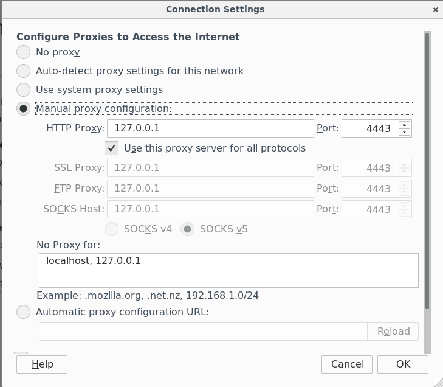
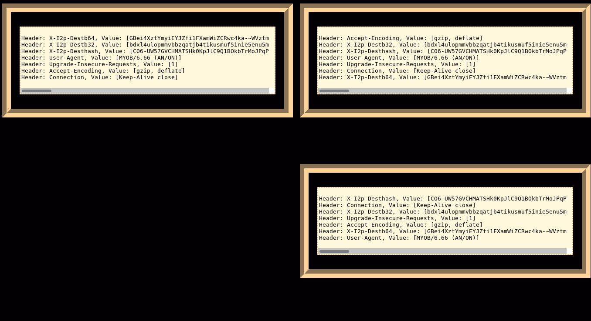
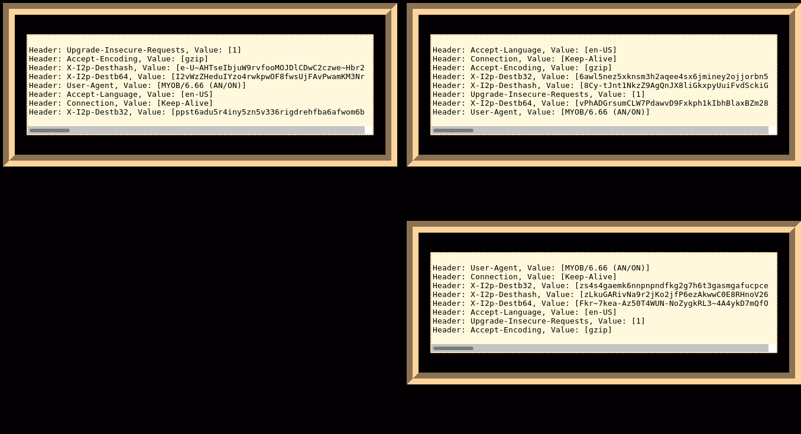
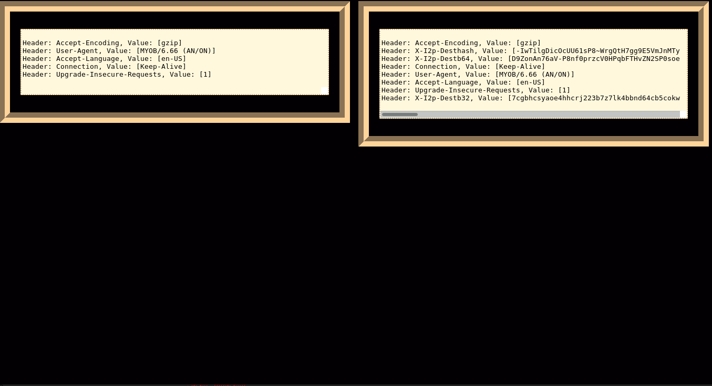
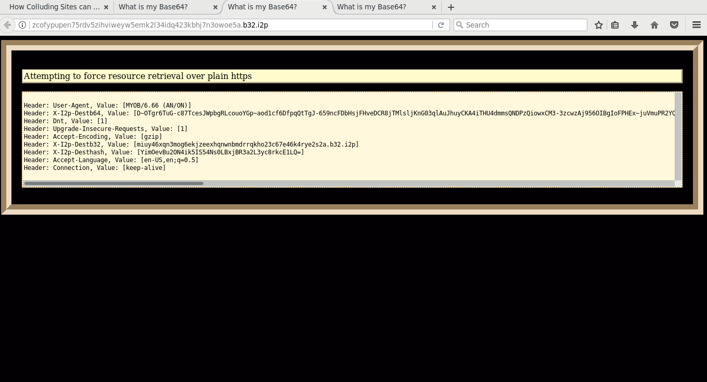
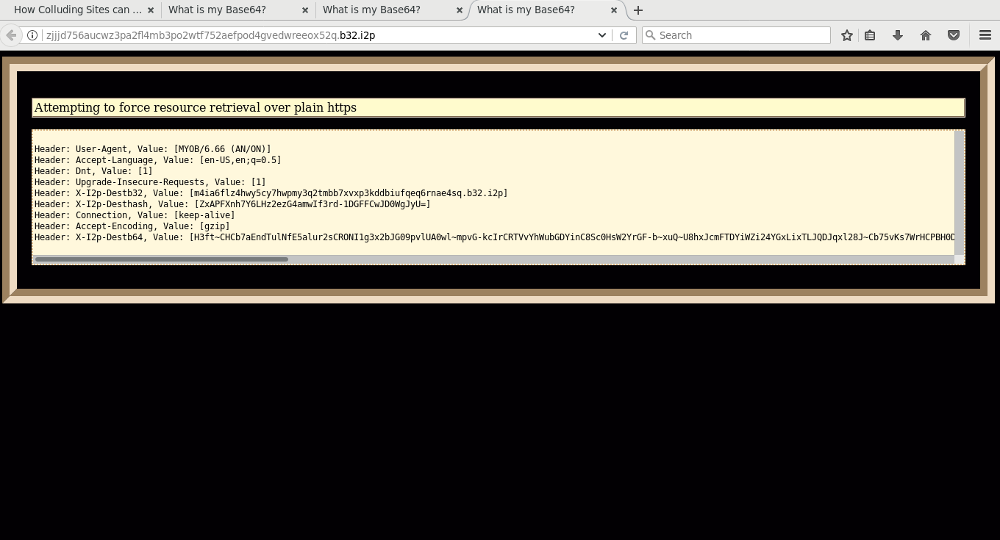
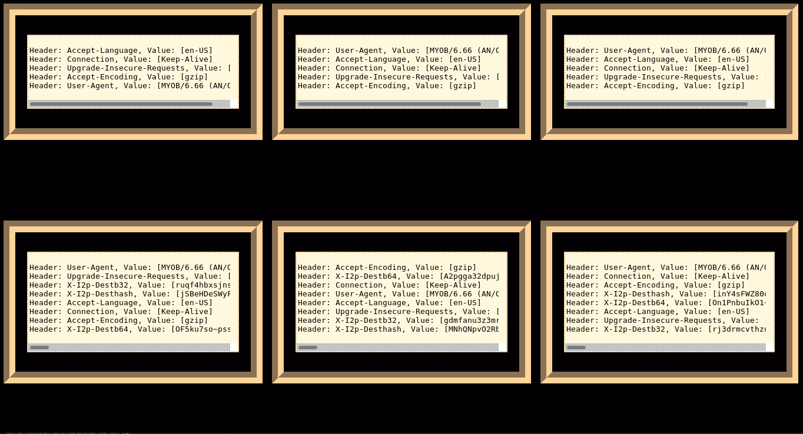

Destination-Isolating i2p HTTP Proxy(SAM Application)
=====================================================

*one eepSite, one destination.*

This is an i2p SAM application which presents an HTTP proxy(on port 4443 by
default) that acts as an intermediate between your browser and the i2p network.
Then it uses the SAM library to create a unique destination for each i2p site
that you visit. This way, your unique destination couldn't be used to track you
with a network of colluding sites. I doubt it's a substantial problem right now
but it might be someday. Facebook has an onion site, and i2p should have
destination isolation before there is a facebook.i2p.

Excitingly, after like a year of not being able to devote the time I should
have to this, I've finally made it work. I am successfully using this proxy to
browse eepSites pretty normally. There are still a few bugs to chase down, but
if somebody else wanted to try it out, I might not *totally* embarass myself.

[**i2p link** A reference to this issue found on zzz.i2p, that I should have put in the readme sooner.](http://zzz.i2p/topics/217)

What works so far:
------------------

### The http proxy

Again, *still pretty experimental*, but currently it is possible to set
your web browser's HTTP proxy to localhost:4443 and use it to browse eepSites.
I haven't been able to crash it or attack it by adapting known attacks on
browsers and HTTP proxies to this environment. It should at least fail early if
something bad happens.

Less straightforward.

#### User-Defined Jump Hosts

Addresshelper/Jump hosts work a little bit differently in this proxy than they
do in the regular http proxy. The first thing is that they only partially work.
Adding URL's to a local(Managed by the proxy itself) addressbook from valid
redirect URL's works, and following redirects for unknown hosts works. Following
redirects for known hosts works only if they are in the local, proxy-managed
addressbook. But redirects recieved by visiting
service\_url.i2p/jump/target\_url.i2p don't work. Not sure how big a deal that
is but I'm going to figure it out regardless.

I took the opinion that the person running the application should be able to
decide at runtime whether to use a jump service or now. If a jump service is
optionally specified(it can be used without jump service at all) then it is
implicitly trusted as a source of all unknown addresses. Eventually this
behavior will be configurable. I'm almost ready to do that.

#### Examples

##### firefox

##### curl

        curl -x 127.0.0.1:4443 http://i2p-projekt.i2p

##### surf

        export http_proxy="http://127.0.0.1:4443" surf http://i2p-projekt.i2p

#### Current Concerns:

If it wasn't super, super obvious to everyone, it's really, really easy to tell
the difference between this proxy and the default i2p/i2pd http proxies and I
don't think there's anything I can do about that.

I am now fairly certain that it can't be forced to retrieve URL's outside the
i2p network in properly configured browsers under normal circumstances. Remember
to set [*] Use this proxy server for all protocols or other relevant browser
configurations. This appears to be the default behavior for surf and uzbl.

Before version 0.21, a framework for generating service tunnels ad-hoc will also
be in place. This will be used for fuzz-testing the http proxy and the pipe
proxy. Almost everything will be improved by the availability of this.

I'm pretty sure I need to make the individual sub-proxies handle their own
cookie jars. I think this is as just setting the jar variable in the http
client. Currently working this out.

Still a little unreliable when it has to download a bunch of stuff from a single
site. If it times out, refreshing the page usually works. This is happening much
less often now. It helps to have a well-integrated router.

Elephant in the room #1, it's kind of unfortunately named. I really have a knack
for that shit.

Elephant in the room #2, it runs excellent on anything that can work with the
named pipe implementation in regular Go. Which makes Windows a real bitch. I
could take shortcuts that would limit the functionality available to Windows
people, or figure out some way to implement that functionality on a per-platform
basis without losing functionality. Oh shit conditional compilation in go is
super easy! An early Windows version is available, but everything that's a named
pipe in a Unix is a real file in Windows. So only use the HTTP proxy. Ever. At
least until I find a way to ensure that sent requests are cleared from the file.
Preliminary Windows support is enabled by turning the FIFO's into files and
specifying their behavior in a windows-only version of si-fs-helpers.go. If this
turns out to be good enough then this is how I'll keep doing it.

### The pipes

Moved to [misc/docs/PIPES.md](misc/docs/PIPES.md)

What I'm doing right now:
-------------------------

Implementing pipe-controlled service tunnels.

What the final version should do:
---------------------------------

The final version should use the parent pipe and the aggregating pipe to send
and recieve requests as an http proxy in the familiar way.

Version Roadmap:

  * ~~0.17 - Named Pipes work for top-level i2p domains and can retrieve~~
   ~~directories under a site~~
  * ~~0.18 - Named Pipes for i2p domains and can retrieve subdirectories,~~
   ~~which it caches in clearly-named folders as normal files(Containing HTML)~~
  * ~~0.19 - Expose an http proxy that hooks up to the existing infrastructure~~
   ~~for destination isolation~~
  * 0.20 - ~~Ready for more mainstream testing~~, ~~should successfully isolate~~
   ~~requests for resources embedded in the retrieved web pages Addresshelper.~~
  * 0.21 - Should be able to generate services on the fly by talking to the SAM
  bridge. First worthwhile release for people who aren't shell enthusiasts.
  * 0.22 - Library-fication should be finished by here. Turning the underlying
  code into a library will mostly be a matter of identifying which features need
  to be exposed for it to be useful in that way. I'll update the number when
  I've written go-based tests for it.

Silly Questions I'm asking myself about how I want it to work:
--------------------------------------------------------------

Definitely not going to do any more filtering than I already do. Instead I'm
going to do build a different proxy to do that and demonstrate how to connect
the two.

For right not, this proxy is definitely only intended for browsing in the i2p
network and should not be combined with Tor in like, a FoxyProxy type situation,
until someone has figured if there's a way to guarantee TorButton and all the
Stream-Isolation stuff works.

Installation and Usage:
=======================

Moved to [misc/docs/INSTALL.md](misc/docs/INSTALL.md)

Screenshots:
------------

### using surf with classic proxy against 3 test sites.

### using surf against 3 test sites.

### using the new proxy against the same site twice.

### using Firefox against test site 1.

### using Firefox against test site 2.

### using Firefox against test site 3.

### using multiple visits to all test sites.

### screenshot of it in development, with the pipes.

